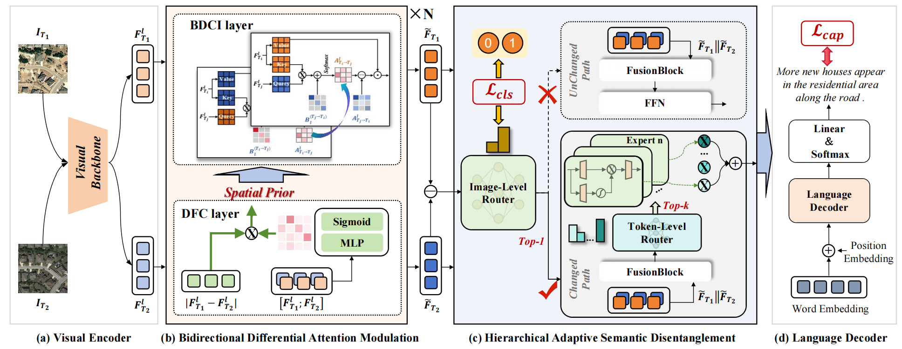
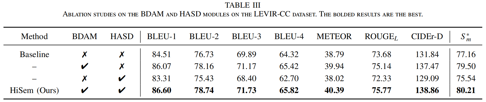
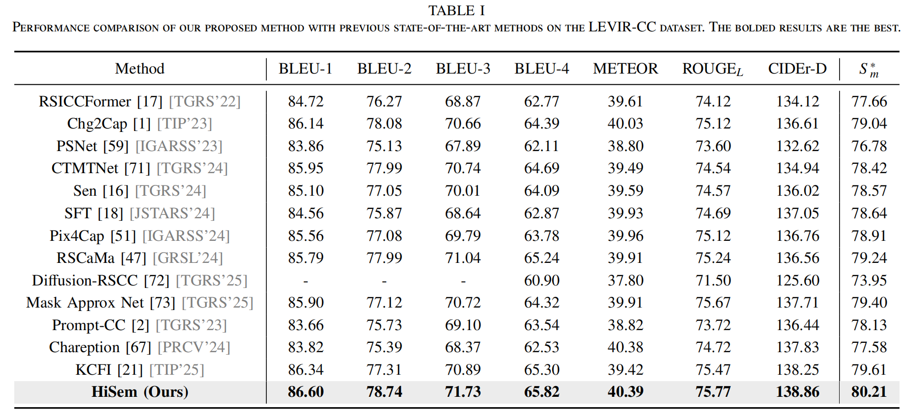
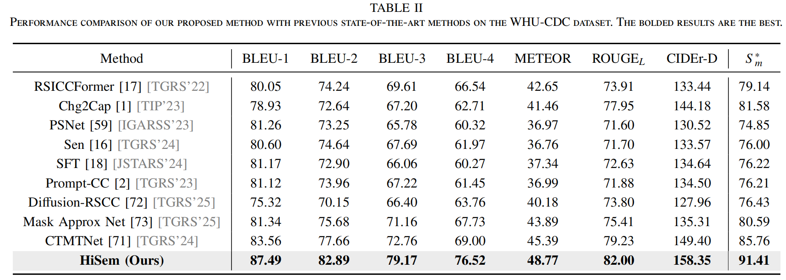

# HiSem: Hierarchical Semantic Disentangling for Remote Sensing Image Change Captioning

<p align="center">
  <a href="https://ieeexplore.ieee.org/abstract/document/11570222">
    
  </a>
  <a href="https://scholar.googleusercontent.com/scholar.bib?q=info:1xNgkOZOfdkJ:scholar.google.com/&output=citation&scisdr=CskwzKogEOOEvKpPchM:AM1tuoMAAAAAanlJahNafmbh4Dvu5FGxoHM0tTg&scisig=AM1tuoMAAAAAanlJav4aCTx2gGuFwkHDJ26LJVI&scisf=4&ct=citation&cd=-1&hl=zh-CN">
    
  </a>
</p>

<p align="center">
  <a href="https://man-wang-star.github.io/">Man Wang</a>,
  <a href="https://chen-yang-liu.github.io/">Chenyang Liu</a>,
  <strong>Wenjun Li</strong>,
  <strong>Feng Ni</strong>,
  <a href="https://ccs.imu.edu.cn/info/1020/2043.htm">Bing Jia</a>,
  <a href="https://ccs.imu.edu.cn/info/1020/1847.htm">Baoqi Huang</a>,
  <a href="https://ccs.imu.edu.cn/info/1023/2411.htm">Riting Xia</a>,
  <a href="https://scholar.google.com.hk/citations?hl=en&user=kNhFWQIAAAAJ">Zhenwei Shi</a>
</p>

<p align="center">
  
</p>

<p align="center">
  <strong>Accepted by IEEE TGRS 2026 🎉🎉🎉</strong>
</p>

---

## ⭐ Introduction

This repository provides the official implementation of:

> **HiSem: Hierarchical Semantic Disentangling for Remote Sensing Image Change Captioning**

If this project is helpful to your research, please consider giving it a ⭐.

---

## 🛠️ Installation and Dependencies

```bash
git clone https://github.com/Man-Wang-star/HiSem.git
cd HiSem
conda create -n HiSem_env python=3.9
conda activate HiSem_env
pip install -r requirements.txt
```

---

## 📂 Data Preparation

### Dataset

Download the dataset from the following link:

- <a href="https://github.com/Chen-Yang-Liu/LEVIR-CC-Dataset">LEVIR_CC dataset</a>
- <a href="https://www.kaggle.com/datasets/yuehaozhang1109/whu-cdc">WHU_CDC dataset</a>

The LEVIR-CC and WHU-CDC datasets share the same data structure, organized as follows:

```text
├─/root/Data/LEVIR_CC/
        ├─LevirCCcaptions.json
        ├─images
             ├─train
             │  ├─A
             │  ├─B
             ├─val
             │  ├─A
             │  ├─B
             ├─test
             │  ├─A
             │  ├─B
```

### Data preprocessing

```bash
python preprocess_data.py
```

---

## 🚀 Training

Run the following command to train the model:

```bash
python train.py
```

---

## 🔍 Evaluation

Evaluate a trained model using:

```bash
python test.py
```

---

## ⚠️ Notes

- Please modify the source code of CLIP package, please modify CLIP.model.VisionTransformer.forward() as [<a href="https://github.com/Chen-Yang-Liu/PromptCC/issues/3">this</a>].

---

## 📊 Experimental Results

### Quantitative comparison

<p align="center">
  
</p>

### Qualitative results

<p align="center">
  
</p>

<p align="center">
  
</p>

---

## 📝 Citation

If you use this project in your research, please cite:

```bibtex
@article{wang2026hisem,
  title={HiSem: Hierarchical Semantic Disentangling for Remote Sensing Image Change Captioning},
  author={Wang, Man and Liu, Chenyang and Li, Wenjun and Ni, Feng and Jia, Bing and Huang, Baoqi and Xia, Riting and Shi, Zhenwei},
  journal={IEEE Transactions on Geoscience and Remote Sensing},
  volume={64},
  pages={5628117--5628117},
  year={2026},
  publisher={IEEE}
}
```

---

## 🤝 Acknowledgements

This project is inspired by or built upon the following repositories:

- [RSCaMa](https://github.com/Chen-Yang-Liu/RSCaMa/tree/main)

We sincerely thank the authors for making their work publicly available.

---
